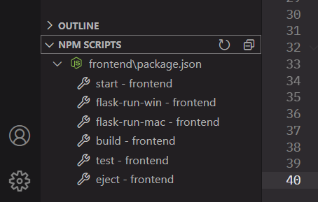
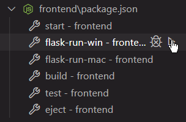

# TEMG4952A - Team 5

The repository of Team 5 for the HKUST course TEMG4952A "Special Project: Financial Investment Prototyping for UBS Zurich".

## Table of Contents

1. [Initial Set-up](#1-initial-set-up)
2. [Start Development Server](#2-start-development-server)
3. [Weekly Progress](#3-weekly-progress)

## 1. Initial Set-up

Prerequisite: Install Python 3 in your system.

### 1.1 For Windows Users,

1. Open Powershell and change directory to this repository's root (`cd path\to\root\here`)
2. Run the following commands:

   ```
   cd .\backend\
   py -m venv venv
   .\venv\Scripts\activate
   pip install -r requirements.txt
   flask run
   ```

3. Keep this Powershell window running in background. At the same time, open another Powershell window and change directory to this repository's root
4. Run the following commands:
   ```
   cd .\frontend\
   npm install
   npm start
   ```

### 1.2 For Mac Users,

1. Open Terminal and change directory to this repository's root (`cd path/to/root/here`)
2. Run the following commands:

   ```
   cd backend/
   python3 -m venv venv
   . venv/bin/activate
   pip install -r requirements.txt
   flask run
   ```

3. Keep this Terminal window running in background. At the same time, open another Terminal window and change directory to this repository's root
4. Run the following commands:
   ```
   cd frontend/
   npm install
   npm start
   ```

### 1.3 Troubleshooting

If you failed to run `npm start` after running `npm install` at the `frontend/` directory, try re-installation all the npm packages:

1. Delete `frontend/package-lock.json`
2. Delete `frontend/node_modules` folder
3. Run `npm cache clear --force` at the `frontend` directory
4. Re-run `npm install`

## 2. Start Development Server

### 2.1 Via Command Line

1. `cd frontend/`
2. Windows users: `npm run flask-run-win` ; Mac users: `npm run flask-run-mac`
3. Keep this terminal running in background and open another terminal window. Change directory to this repository's root
4. Run the following commands:
   ```
   cd frontend/
   npm start
   ```

### 2.2 Via VS Code Interface

1. If you have VS Code installed, open this repository's root folder in VS Code.
2. Open the "Explorer" tab at the sidebar with the shortcut of "Ctrl + Shift + E"
3. Expand the "NPM SCRIPTS" tab at the bottom of the Explorer sidebar window
   <br />
   
4. For Windows users, hover over `flask-run-win - frontend` and press the right button to run the script
   <br />
   

   If you are a Mac user, hover over `flask-run-mac - frontend` and press the right button

5. Hover over `start - frontend` and press the right button to run the script

## 3. Weekly Progress

[Click here](./WeeklyProgress.md) to see the work progress for each week.
