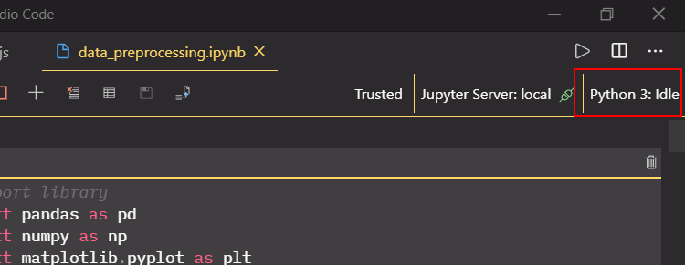
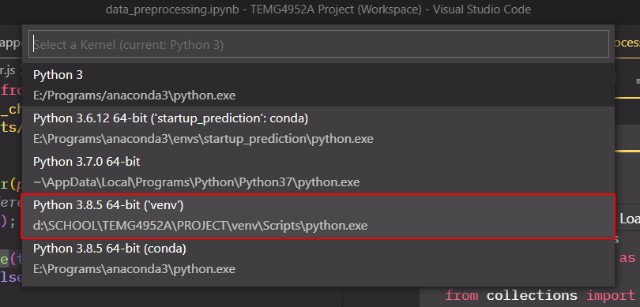

# TEMG4952A - Team 5

This is the repository of Team 5 for the HKUST course TEMG4952A "Special Project: Financial Investment Prototyping for UBS Zurich" in 2020-21 Winter Semester. For the final front-end results, see the instructions below. For the back-end models, see `..\data_and_model\stable_prediction\Models_training.ipynb`.

Note: this project's raw data are the CSV files from `bulk_export` folder from Crunchbase at the end of Dec 2020.

## Table of Contents

1. [Initial Set-up](#1-initial-set-up)
2. [Start Development Server](#2-start-development-server)
3. [View Jupyter Notebooks](#3-view-jupyter-notebooks)
4. [Dependencies](#4-dependencies)
5. [Project Methodology](#5-project-methodology)
6. [Weekly Progress](#6-weekly-progress)

## 1. Initial Set-up

### 1.1 Prerequisites

We assume that Python 3 and Jupyter Notebook is already installed in your system.

This project's GUI uses [Mapbox](https://www.mapbox.com/maps/)'s APIs to render a world map in data visualization. Mapbox's APIs require an access token that is obtainable after registering for an account in [this page](https://account.mapbox.com/auth/signup/). After registering for an account, head to your [Mapbox account page](https://account.mapbox.com/) and copy your default public token.

1. Create a file called `.env` in the root of the `frontend/` folder
2. Copy the content in `frontend/.env.example` and paste it into the `.env` file you just created. Your `.env` file should look like:
   ```
   REACT_APP_MAPBOX_API_KEY=
   ```
3. At the end of the line, paste in the Mapbox default public token you previously copied from Mapbox's account page. After that, it should look something like:
   ```
   REACT_APP_MAPBOX_API_KEY=pk.XXXXXXXX
   ```
4. For Windows users, follow the remaining steps in [section 1.2](#12-for-windows-users). For Mac users, follow the remaining steps in [section 1.3](#13-for-mac-users).

### 1.2 For Windows Users,

5. Open Powershell and change directory to this repository's root (`cd path\to\root\here`)
6. Run the following commands:

   ```
   py -m venv venv
   .\venv\Scripts\activate
   pip install -r requirements.txt
   cd backend\
   flask run
   ```

   If you encountered the following error when running `.\venv\Scripts\activate`, read [item 1.4.1](#141-running-scripts-is-disabled-on-the-system) in the Troubleshooting section.

7. Keep this Powershell window running in background. At the same time, open another Powershell window and change directory to this repository's root
8. Run the following commands:

   ```
   cd .\frontend\
   npm install
   npm start
   ```

### 1.3 For Mac Users,

5. Open Terminal and change directory to this repository's root (`cd path/to/root/here`)
6. Run the following commands:

   ```
   python3 -m venv venv
   . venv/bin/activate
   pip install -r requirements.txt
   cd backend && flask run
   ```

7. Keep this Terminal window running in background. At the same time, open another Terminal window and change directory to this repository's root
8. Run the following commands:

   ```
   cd frontend/
   npm install
   npm start
   ```

### 1.4 Troubleshooting

#### 1.4.1 Running scripts is disabled on the system

For Windows users, if you encounter the following error while running `.\venv\Scripts\activate`:

> .\venv\Scripts\activate : File path\to\repo\root\backend\venv\Scripts\Activate.ps1 cannot be loaded because running scripts is disabled on this system.

1. Open "Start" menu by pressing the Window key on the keyboard
2. Search for "Windows Powershell"
3. Run Powershell as Administrator
4. Run the following command:

   `Set-ExecutionPolicy -Scope CurrentUser -ExecutionPolicy Unrestricted`

5. Type `Y` (Yes) when it asks whether you want to change the execution policy
6. Retry the commands in [section 1.2](#12-for-windows-users) item 6

#### 1.4.2 `npm start` not working

If you failed to run `npm start` after running `npm install` at the `frontend/` directory, try re-installation all the npm packages:

1. Delete `frontend/package-lock.json`
2. Delete `frontend/node_modules` folder
3. Run `npm cache clear --force` at the `frontend` directory
4. Re-run `npm install`

## 2. Start Development Server

The following steps are used to start up the React and Flask server in order to view the GUI. Before running these steps, make sure that you have already finished the initial set-up guide in Step 1.

### 2.1 Via Command Line

1. `cd frontend/`
2. Windows users: `npm run flask-run-win` ; Mac users: `npm run flask-run-mac`
3. Keep this terminal running in background and open another terminal window. Change directory to this repository's root
4. Run the following commands:

   ```
   cd frontend/
   npm start
   ```

### 2.2 Via VS Code Interface

1. If you have VS Code installed, open this repository's root folder in VS Code.
2. Open the "Explorer" tab at the sidebar with the shortcut of "Ctrl + Shift + E"
3. Expand the "NPM SCRIPTS" tab at the bottom of the Explorer sidebar window
   <br />
   
4. For Windows users, hover over `flask-run-win - frontend` and press the right button to run the script
   <br />
   

   If you are a Mac user, hover over `flask-run-mac - frontend` and press the right button

5. Hover over `start - frontend` and press the right button to run the script

## 3. View Jupyter Notebooks

### 3.1 View in Browser

1. Open Terminal and change directory to the root folder of this repository (`cd path/to/root/`)
2. For Windows users, run `.\venv\Scripts\activate`. For Mac users, run `. venv/bin/activate`
3. Run `jupyter notebook`
4. A new browser window will pop up. Click on the `data_and_model` folder on the browser screen and you can click on different notebooks to view them

### 3.2 View in VS Code

Prerequisite: Make sure that [Python extension](https://marketplace.visualstudio.com/items?itemName=ms-python.python) is installed in your VS Code.

1. Open Explorer in the sidebar, expand the `data_and_model` folder and double click on a Jupyter notebook you wish to view
2. On the upper right corner, click the "Python 3: Idle" button
   <br />
   
3. In the new window, choose the Python interpreter where the path looks something like `path\to\root\venv\Scripts\python.exe` (Windows) or `path/to/root/venv/bin/python` (Mac)
   <br />
   
4. Your Jupyter notebook now runs in the virtual environment that we've set up earlier in Step 1. You can now run the cells in the notebook

## 4. Dependencies

[Click here](./Dependencies.md) to see the libraries and frameworks used in this project.

## 5. Project Methodology

[Click here](./ProjectMethodology.md) to see the methodology used in the project, e.g. code structure.

## 6. Weekly Progress

[Click here](./WeeklyProgress.md) to see the work progress for each week.
